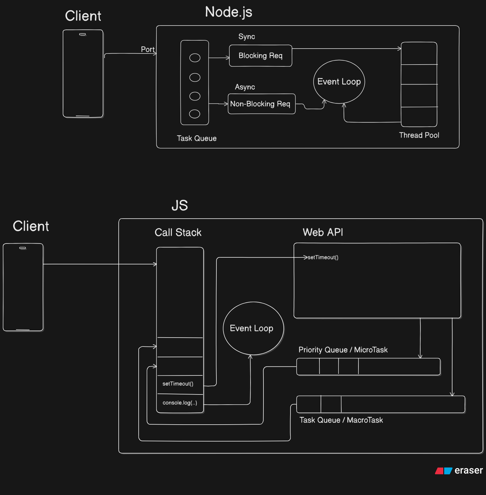

### REST API

[REST API](11-rest-api/index.md)

### Node Versioning

[Node Versioning](10-node-versioning/index.md)

### HTTPS Methods

[HTTPS Methods](08-https-methods/httpMethods.md)

# Project Title

A brief description of your project.

## Getting Started

Instructions on how to get a copy of the project up and running on your local machine.

### Prerequisites

List any software, libraries, or hardware needed to run this project.
Lists :

- **List 1** : some description
- **List 2** : some description

### Installing

A step-by-step guide on how to install the project.

## Usage

Instructions on how to use the project or its features.

### REST API Documentation

See the [REST API Guide](11-rest-api/index.md) for details about the REST API implementation.

## Contributing

Guidelines on how to contribute to the project.

## License

This project is licensed under the [License Name] - see the [LICENSE.md](LICENSE.md) file for details.

## Acknowledgments

Mention anyone who contributed to the project or inspired you.
